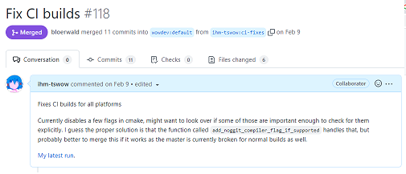
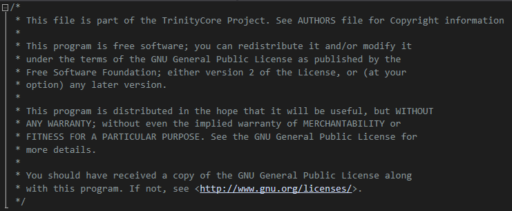
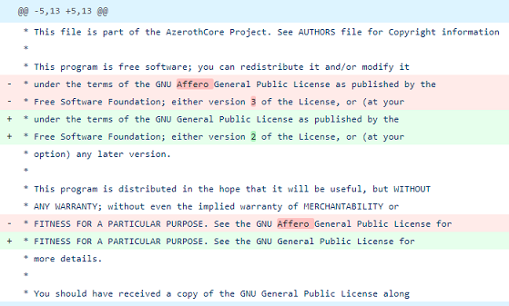

# An open letter to AzerothCore

The WoW emulation and modding scenes are nearing their 18th birthdays, in a time of both great uncertainty and excitement for our shared community. While Blizzards classic realms continue to gut the blizzlike servers that have been a staple of our scene since its inception, the increased availability of authoritative data about the game has opened the door to more accurate emulation of the older expansions than ever before. Additionally, the rapid development of powerful modding tools over just the past couple of years are starting to show just how far the game can be pushed both as a technical and an artistic medium.

It is my assumption that we all share this space out of love for the game and virtual world many of us grew up with, and in each our own way seek to restore or reinterpret the impressions it has left us with. It is also my belief that the vast majority of actors in this scene, contrary to the belief of many players, largely seeks to co-exist honestly and in peace with one another.

Even so, as with any community, conflict will eventually happen. Among our open source emulators, there are many disagreements on the best way to run a project, collect patches and the rules to hold users of those projects to. Lately, one such disagreement has cropped up in regards to recent comments by and changes to the AzerothCore emulator.

## Structure

This document will seek discuss this relationship between wow emulation projects, their contributors, private servers and repacks. It will then go on to explain the situation with the AzerothCore emulator, the recent issues that have arisen, and finally how I believe those issues can be solved or mitigated.

The structure is as follows:
- A brief explanation of how licensing works in open source projects, for those completely new to the subject
- A very brief explanation of the licenses commonly used in this scene
- An explanation of the problems that have arisen around AzerothCore
- An extensive list of potential solutions to these problems.
- An appeal to respecting licenses beyond their purely legal implications

For the initial sections, I will attempt to be as impartial as I can, while later sections will include more of my personal opinions and thoughts on the topic.

I will not be discussing the potential complications or moral issues surrounding emulating Blizzard services, being involved with private servers that are often illegal or including WDB data in the open source repositories. None of this changes any of the scenes internal relationships that I will seek to discuss, and is better dealt with in a separate document.

### Disclaimers
I do not speak for any project or anyone else but myself. For convenience, I will occasionally speak of projects as coherent entities, such as TrinityCore/MaNGOS, but it is crucial to the point of this document to understand that there is no such thing as a unified project entity in open source, simply individual contributors and those administering their work under organized names and repositories. 

I will occasionally refer to TrinityCore/MaNGOS as "we", because I have under various names been a part of these projects and their surroundings as a contributor and server operator. I still do not speak for any other participants or maintainers of those projects.

Sometimes, the names TrinityCore/MaNGOS/AzerothCore will refer to any or all of their maintainers, their contributors, their users and their code. If you feel like this distinction is unclear anywhere in the document, please let me know so I can correct it.

I take no responsibility for the implementation of solutions presented here. AzerothCore is not my project and the decisions on how to go about it has to lie with their maintainers.

## Table of Contents

* [Who is this for / Who Cares?](#who-is-this-for--who-cares)
* [Licensing](#licensing)
  * [What happens when I make a pull request?](#what-happens-when-i-make-a-pull-request)
  * [What licenses are used in WoW Emulation?](#what-licenses-are-used-in-wow-emulation)
    * [MIT](#mit)
    * [GPLv2](#gplv2)
    * [AGPL](#agpl)
    * [Wait, multiple licenses? Is that allowed?](#wait-multiple-licenses-is-that-allowed)
    * [A short history on the GPL and the AGPL](#a-short-history-of-the-gpl-and-the-agpl)
* [AzerothCore](#azerothcore)
    * [Happenings](#happening-1-h1-removing-gplv2-or-later-headers)
        * [Happening 1: Removing GPLv2-or-later headers](#happening-1-h1-removing-gplv2-or-later-headers)
        * [Happening 2: Offering excemptions to custom servers](#happening-2-h2-offering-excemptions-to-custom-servers)
        * [Happening 3: Re-publishing "How do wow private servers work and why i hate most of them"](#happening-3-h3-re-publishing-how-do-wow-private-servers-work-and-why-i-hate-most-of-them)
        * [Happening 4: Attempting to change AGPL files back to GPLv2-or-later](#happening-4-h4-attempting-to-change-agpl-files-back-to-gplv2-or-later)
    * [Problems](#problem-1-p1-code-ownership)
        * [Problem 1: Code Ownership](#problem-1-p1-code-ownership)
        * [Problem 2: Re-licensing GPL is not possible](#problem-2-p2-re-licensing-gpl-is-not-possible)
        * [Problem 3: Muddying the Waters](#problem-3-p3-muddying-the-waters)
        * [Problem 4: Weapons of Mass Destruction](#problem-4-p4-weapons-of-mass-destruction)
    * [Solutions](#solution-1-s1-stop-calling-mangostrinitycore-private-servers-thieves)
        * [Solution 1: Stop calling MaNGOS/TrinityCore servers thieves](#solution-1-s1-stop-calling-mangostrinitycore-private-servers-thieves)
        * [Solution 2: AGPL Reversal](#solution-2-s2-agpl-reversal)
            * [Why the old solution doesn't work](#why-the-old-solution-doesnt-work)
            * [My Proposal: Stage 1 (Disarmament)](#my-proposal-stage-1-disarmament)
            * [My Proposal: Stage 2 (Disassembly)](#my-proposal-stage-2-disassembly)
            * [My Proposal: Stage 3 (Decimation)](#my-proposal-stage-3-decimation)
            * [My Proposal: Stage 4 (Reassembly)](#my-proposal-stage-4-reassembly)
        * [Solution 3: Only make promises that you can keep](#solution-3s3-only-make-promises-that-you-can-keep)
    * [Bonus: MySQL and the AGPL](bonus-mysql-and-the-agpl)
* [The value of Licensing](#the-value-of-licensing)
    * [Goodwill](#goodwill)
    * [Final Words](#final-words)

## Who is this for / Who Cares?

I know most people don't care much for license blabber, and I'm not coming to preach why anyone should. I only seek to ensure this information is available for those who **are** interested in the topic. In short, my aims here are:

- That any contributor, regardless of experience, can know the history of this scene, the projects that were involved and how those projects operated.

- That any contributor, regardless of experience, understand what happens when they submit code to a public project.

- That any contributor, regardless of experience, understands the implications of what license they attach to the code they publish.

- To make the case for taking licenses seriously for those of us who value what they've inspired.

- To illustrate what can go wrong if we stay on our current trajectories.

None of this will be possible to achieve fully with a single document like this, and for the sake of scope I will focus on licensing as it relates to the MaNGOS trees.

Read only parts you find interesting here, and maybe you'll find there are things you didn't know you agreed with. I know that the language is something thick, but I have attempted to end every section with a short summary of the most important points.

## Licensing

If you contribute patches to an open source project, you are the owner of those patches, not the project or even the original author of the code you patched. Very small patches aren't necessarily coverable by copyright, there are only so many ways you can change a single number or iterate a table.

This is a great protection for developers own code, but it makes anything that anyone published to an open source project very brittle and unstable. What if a contributor suddenly changes their mind and don't want to allow their code in other repositories anymore?

This is why most open source projects use some kind of licensing instead of allowing anyone to publish code under uncertain terms and hoping for the best. A license makes it clear what terms the various files in the project are expected to follow, in a way that isn't prone to individual contributors changing opinions. 

Once you publish code under an open source license, attempting to later revoke those terms is rarely permitted by the license itself. Additionally, if someone modifies your code and breaches your license in doing so, this does **not** give you permission to add their violating code to your project under your own license without their permission.

### What happens when I make a pull request?

When you submit code to an open source project, you usually do this by editing files that already exist in their source tree. At the top of each code file, there is (and should be) what is called a license header. This is a comment that describes how people are allowed to use the code in this file. If you submit patches to such a file, it is assumed that you agree to permit your code to be used in accordance to this license.

<p align="center">
  
  <br />
  <i> Pull Request</i>
</p>

After you've created a pull request, and even after your code has been merged, you are still the sole owner of your own code[^1]. All that has happened when you made your changes public is that you've agreed to license your code to be used under the same terms as the rest of the contents of that file, even if you did not write the license header yourself.

The project is not allowed to change the license of your patches without your permission, which is why it can often get very complicated to change projects licenses after the fact.

After you've created a patch with one license, there is nothing stopping you from **re-licensing your own patches** under any combination of other licenses, even if those licenses are incompatible with your original license, and impossible to use in combination of the larger file you edited. In the case of editing existing code, you can of course not just change something about it and use that to re-license the entire thing.

**In Summary:**
- When you publish patches to an open source project, you do not relinquish ownership of your code. You can license your code under multiple open source licenses, even after the fact.

- When you publish patches to a file with a license header, you effectively release your patches to be used under that license.

- Very few open source licenses allow you to terminate the license after the fact.

- When lots of people work in a single function and change each others code over and over, ownership becomes naturally complicated.

- If someone breaches your license, this does not give you permission to add their modifications to your own code.

[^1] If you are producing code while employed, the company you work for is instead usually the owner of the code you produce for them. If you work for a server and produce code for them, it is usually them who decides what licenses you are allowed to publish under.

### What licenses are used in WoW emulation?

There are three relevant licenses commonly used in WoW emulation today, the "MIT" license, the "GPLv2-or-later" license and the AGPL license. There are more in active use, but these span the most common concerns. I will briefly cover what these licenses are and how they work specifically with wow emulation projects.

##### MIT


 
The MIT license is one of the most permissive licenses that exists, and is used by projects like NovusCore. It places no restrictions on how you can use the software, and requires nothing but that you include that license in the original source package. There are a few similar licenses to the MIT, such as the BSD license.

##### GPL


The GPL licenses are a family of licenses published by the Free Software Foundation. Their purpose is to be very permissive licenses, allowing mostly any use for any purpose, but with the restriction that you are required to provide the original source code with the same license intact to anyone who uses your software. 

##### GPLv2
The GPLv2 is one such popular license, used by many MaNGOS-based emulators like TrinityCore. In WoW emulation, the GPLv2 requires that emulation repacks provide sources to anyone who downloads it, but it does not require private servers to provide source code to any of its players.

##### AGPL


The AGPL is another such popular license, used by many antrix/ascent-based projects like ArcEmu, but also by some MaNGOS-based projects like AzerothCore. It works mostly the same as the GPLv2 license, but it also requires private servers to provide source code to all of its players. 

#### Commercial Use

It is important to mention that neither the MIT nor any of the GPL licenses restricts the use of a program in commercial projects. If you publish code under any of these licenses, you permit anyone to re-sell or otherwise make money off your code in any way that they see fit. Of course, in the case of wow emulation, there may be other parties that have a say here, but you're not one of them.

#### Wait, multiple licenses? Is that allowed?
The GPLv2 and the AGPL are technically incompatible, meaning that you cannot use both GPLv2 and AGPL code in the same project. However, because MaNGOS-based projects use the phrasing "GPLv2, or any later version as published by the Free Software Foundation", those files are allowed to be reinterpreted as any newer version of the license, including the GPLv3, which **is** compatible with the AGPL as long as they exist in different files.

This means that azerothcore, as far as MaNGOS or TrinityCore are concerned, are allowed to place AGPL-licensed files in their project, and effectively turning the entirety of their program into one that should follow the AGPL, not just the GPLv2.

**In Summary:**

- MIT is one of the most permissive licenses, and can usually be combined with almost any other license in one project.

- GPLv2 is a license that requires same-licensed source code included in repacks, but not on servers.

- The AGPL is a license that requires same-licensed source code included for both repacks and servers.

- GPLv2 is incompatible with the AGPL, but GPLv2-or-later is not.

- AzerothCore combines GPLv2-or-later with the AGPL to create a whole program that is effectively covered by the AGPL.

- All of the common licenses in WoW emulation projects grants unrestricted permission to re-sell or make money off the licensed code, as long as the rest of the license is respected.

### A short history of the GPL and the AGPL

<p align="center">  </p>

_This section is here for context. While it holds some important keys for later, it's not essential for understanding the other parts on their own._

The GPL licenses were created by the Free Software Foundation (FSF), who believe that source code to all software should be freely available to anyone who uses it. Instead of advocating piracy, the FSF advocates that those who wants a world of free software should use licensing that further these goals, and disallow use of their software with other software that don't respect this freedom. The GPL is an infectuous license that puts requirements on other code it is used together with, and this is on purpose. Including GPL code in any project means that the entire software package must comply to the GPL, meaning closed-source software is not legally allowed to take advantage of it.

Most sympathizers of the FSF and GPL believe this should apply any time you buy or download a program from the internet and run it on your computer, so that you yourself can improve or customize the program as you see fit, and share it freely with your friends under the same terms that you received it.

However, as the internet became increasingly important for how programs worked in the early 2000s, the FSF were struck with a realization. The protection their previous licenses offered didn't actually cover a program that never executed on a users machine directly, but instead on a remote server. This was the motivation for introducing the AGPL license in 2007, which as we've discussed not only applies to when you download something like a repack to your machine, but also when you play on a remote private server.

The FSF largely considers such remote services a **loophole** of the GPLv2. However, not everyone that uses the GPLv2 agrees with this. Probably the most famoust GPL-licensed project of all time, the linux kernel, explicitly **disallows** their code to be used with anything other than GPLv2, because they don't agree that this is a loophole, but exactly what they intended by applying the original license. Rather, to them, the "loophole" is that the FSF introduced phrasing such as "or any later version" to arbitrarily change the terms that GPL code can operate on, and then using such phrasings in their default recommended license headers. This can very easily end up in the situation where forks of a project enacts a stricter version of the GPL and blocking out even the original project from merging their patches without upgrading themselves, potentially undermining what some would consider the purpose of the license in the first place.

**In Summary:**
- The FSF created the GPL licenses with the purpose of creating software that respects users freedom, and legally block other software that don't do this from benefiting from their work.

- When more and more programs started executed on servers rather than client machines in the early 2000s, the FSF introduced the AGPL to include servers.

- Not everyone agrees with the AGPL, and some felt cheated out when the FSF suddenly published a new license and left a lot of projects open to getting forks that upgraded to a version of the GPL that they didn't agree with.

[^4] Linus Thorvalds primary issue with the GPLv3 was not the AGPL, but the hardware clauses in the GPLv3 itself, and that the FSF left "or-later" clauses in their licenses to allow arbitrary changes in the future, calling it ["sneaky and immoral"](https://youtu.be/7SofmXIYvGM?t=2841).

## AzerothCore

<p align="center">  </p>

First, it is important to note that I do not wish to paint this as assuming malice on AzerothCores part, and I'm well aware lot of these things have come down to misunderstandings and mistakes. Especially, I have no intention of pointing fingers at any individual AzerothCore contributors or maintainers. I believe it is very important that even if we disagree on something strongly, we don't foster a "callout culture", or making individual contributors feel like they've done something wrong just for having fun with WoW servers and doing what they think is right. I will stress that at this stage, nothing here irrevocably broken, none of this has caused any serious damage yet, and most of this can be solved quite easily, as long as AzerothCore maintainers are willing to cooperate. 

#### Structure

There are three separate issues that I've raised with the project, and I will reiterate them briefly here before moving on to solutions. I will divide this sections into categories:

- Happenings. As in, the things that happened and their immediate effects or contradictions.

- Problems. As in, problems with those happenings and what damage they cause or might cause in the future.

- Solutions. As in, what azerothcore can do to improve the situation.

The reason for this separation is that some problems arise from multiple happenings (and other problems!), and some solutions overlap with multiple problems. At the end, I'll include the solution to the MySQL puzzle I left you with on the tracker.

## Happening 1 (H1): Removing GPLv2-or-later headers

The first issue regards the recent patch that removed old GPLv2-or-later headers from the source tree.

Around 8 months ago, AzerothCore published a large PR that replaced license headers in all files of the projects to AGPL. AzerothCore has had their own original files with the AGPL attached in their repository since the projects inception in 2016, the difference now is that this also includes all the old MaNGOS and TrinityCore files that were originally licensed as GPLv2-or-later. 

The immediate result is that other cores can no longer use commits to these files on the AzerothCore repository, since AGPL code cannot be "backported" to GPLv2-or-later. Even if such a re-licensing is not possible, new code added to it does not automatically revert back to GPLv2-or-later. Rather, it becomes _unusable_ until further comments from the authors.

<p align="center"> 
  
  <br/>
  <i>TrinityCore license header</i>
</p>

## Happening 2 (H2): Offering excemptions to "custom servers"

It has come to my attention that AzerothCore leadership occasionally offers "special excemptions" to the AGPL regarding servers "custom content". The reasoning behind AzerothCores license is described as "wanting blizzlike/system/performance patches back". However, there is nothing in the AGPL itself that supports this kind of excemption.

**In Summary:**
- AzerothCore has attempted to grant "excemptions" to the AGPL for custom features.

- The AGPL cannot express such excemptions.

## Happening 3 (H3): Re-publishing "How do WoW private servers work and why I hate most of them"

<p align="center">  </p>

About one year ago, I was made aware of the manifesto and associated video that AzerothCore maintainers produced or collaborated to create some time ago with this title. 

The video contains language that strongly suggest that private server owners frequently disrespected the licenses of emulators like MaNGOS and TrinityCore throughout their history. They do this by selectively quoting the GPL license that state copies of the program should be provided with source code included, without mentioning that the versions of the license in those projects did not cover servers in the first place and still don't to this day. Neither does the video mention that the AGPL has existed as an alternative through most of the history of wow emulation, which those emulators **chose** not to upgrade to despite having the same ability to do so as Antrix/Ascent did in 2008, and AzerothCore did in 2016.

I raised these concerns with Shin directly one year ago, thinking we had come to an agreement that the video was misleading, yet I now see the exact same video has been re-published on the ChromieCraft youtube channel just two months ago seemingly unedited from last time.

**In Summary:**
- AzerothCore has on multiple occasions published a video that makes strong claims suggesting private servers breach or otherwise wrong the licenses of MaNGOS and TrinityCore.

- Both MaNGOS and TrinityCore continue to publish under the GPLv2-or-later license, which permits private servers to use it without giving source code back.

- AGPL is not a new license, it was adopted by Antrix/Ascent as far back as 2008.

## Happening 4 (H4): Attempting to change AGPL files back to GPLv2-or-later

When some of the above happenings were raised with AzerothCore, the initial response was suggesting to completely remove the AGPL license from the repository, or at least rollback old Trinity/MaNGOS files, out of respect for MaNGOS and TrinityCore.

As has already been discussed in this document, it is not just not permitted to change the license of code owned by someone else without their permission, it's **not possible**. For that reason, this amounts to hiding the problem away in the git logs.

<p align="center">  
  <br />
  <i>Reverting APGL back to GPLv2-or-later. This request was rejected and closed after I strongly advised against it.</i>
</p>

## Problem 1 (P1): Code Ownership

When contributors submit patches to AzerothCore, they implicitly do so under the license of the individual files that they patch. If a file says it is licensed under the AGPL, that means they license the patch as AGPL and nothing else. The contributor is still the owner of their own code, as described earlier in this document, and they are in their full right to enforce the AGPL as much as they please. They do not need the AzerothCore organizations permission to do so.

Similarly, while AzerothCores current leadership might not have any malicious intent towards TrinityCore or custom servers, they can only give you their word that they, or any future leadership that replace them, won't change their mind in the future since such statements are not expressed in the AGPL itself.

While such statements might be considered as a true extension of the license for those who make those statements at the time they make them, they still only speak for themselves and their contributions, they cannot speak for anyone else or future contributors who build upon their work, since they also license it under the AGPL when they push.

**In Summary:**
- The only expressed license for AzerothCore is the AGPL (previously also GPLv2-or-later)

- The AGPL makes no excemptions for the type of content the code implements.

- Individual contributors or future azerothcore leadership may at any time change their more "permissive" attitudes, and they will have the full AGPL license to back it up.

## Problem 2 (P2): Re-licensing GPL is not possible

To try to bring clarity to the legal situation of what AzerothCore had done, I sent the following e-mail to the FSF licensing team:

```
A common question that I encounter concerns the following, which I've
yet to find any reputable answer to:

Say that my friend creates a program under the GPLv2 license, and
includes in a source file "A.cpp" the usual license statement that the
program can be redistributed "under the GPLv2, or at your option, any
later version".

It is typically understood that I am allowed to take "A.cpp", move it
into my own AGPLv3 program with its own license header intact, as long
as I also include the GPLv2 license in my published software, since
GPLv2-or-later is compatible with the AGPLv3.

However, am I allowed to take "A.cpp", move it into my own program,
and replace its existing license header with the AGPLv3 license
header, and start modifying it in a way that my friend cannot merge
back the new changes to their version of "A.cpp" without upgrading it
to the AGPLv3?
```

I received the following response:

```
Hello and thank you for writing in.

> A common question that I encounter concerns the following, which I've
> yet to find any reputable answer to:

> Say that my friend creates a program under the GPLv2 license, and
> includes in a source file "A.cpp" the usual license statement that the
> program can be redistributed "under the GPLv2, or at your option, any
> later version".

> It is typically understood that I am allowed to take "A.cpp", move it
> into my own AGPLv3 program with its own license header intact, as long
> as I also include the GPLv2 license in my published software, since
> GPLv2-or-later is compatible with the AGPLv3.

No, that is not exactly right.

GPLv2-or-later is not compatible with AGPLv3. Since GPLv2 is not
compatible with AGPLv3. GPLv2-or-later means only "under GPLv2, with the
option of upgrading", and not "under GPLv2 and also under GPLv3". GPLv3
is narrowly compatible with AGPLv3 via the conditions set forth in
section 13 of both GPLv3 and AGPLv3.

However, since GPLv2-or-later allows you to upgrade to GPLv3, then if
and when you have done the upgrade, you can take advantage of that
narrow compatibility. Please read the following carefully:
http://www.gnu.org/licenses/license-list.html#AGPL

> However, am I allowed to take "A.cpp", move it into my own program,
> and replace its existing license header with the AGPLv3 license
> header, and start modifying it in a way that my friend cannot merge
> back the new changes to their version of "A.cpp" without upgrading it
> to the AGPLv3?

No, you cannot do that, for the reasons above. Compatibility and
relicensing are two separate things, but I appreciate that the
difference is subtle. Please see:
http://www.gnu.org/licenses/gpl-faq.html#WhatIsCompatible
http://www.gnu.org/licenses/gpl-faq.html#WhatDoesCompatMean

I hope this is of help.

--
I am not a lawyer, the above is not legal advice

   Regards, Yoni Rabkin

The services of the GPL Compliance Lab are made possible by
donations from people like you. Please consider supporting us
today by becoming a member [https://my.fsf.org/join] or by making
a donation [https://www.fsf.org/donate].
```

The first part of the response points out that I used the word "compatible" incorrectly, but clarifies the crucial distinction between "re-licensing" and the kind of "upgrade" that the "or-later" clauses permits in the GPL licenses. This means the kind of re-licensing AzerothCore has done is not sanctioned by the FSF to change the GPLv2-or-later license headers in MaNGOS/TrinityCore files.

**In Summary:**
- When I emailed the FSF and asked, the response was that it was not possible to replace license headers in GPLv2-or-later files to the AGPL.
- The response received was not from a lawyer, and was purposefully specific to the exact upgrade AzerothCore had attempted.

## Problem 3 (P3): Muddying the waters

When we have both published articles that speak about other projects as if representing them based only on personal feelings of one group of developers and very selective readings of our licenses, and simultaneously attempt to relicense partial source files that nobody in the scene seems to understand well enough to do properly (as evident by the hasty attempt to undo it when the issue was raised), we are entering territory where even those of us who wishes to assume the best between our projects have to start questioning your intentions. 

AzerothCore is largely outshining other cores in terms of presence in social media and the private server community. When you sit in this position, and then start both painting the picture with your videos as if there is no distinction between the licenses of MaNGOS/TrinityCore and AzerothCore, and at the same time begin re-labeling source files to AGPL only en masse, I don't think it is hard to see why some might consider this as an attempt to erase or hide the past because it does not conform to your own beliefs of what open source software should be.

I personally believe firmly this is not yet a malicious or even conscious attempt on AzerothCores part at undermining other cores or their licenses, but the effect on the larger emulation community remains: you sow the seeds of mistrust that could potentially end up causing conflicts and resentment in the future.

**In Summary:**
- Repeatedly publishing videos that misrepresent history is disrespectful to the cores and contributors who worked on those projects and may disagree with you.

- Aggressively extending the application of AGPL in ways you don't comprehend while doing the above, is sowing the seeds of conflict not just in your own project, but with other projects as well.

<p align="center">
  
  <br />
  <i>Image courtesy of Project Emperor, a custom wow project</i>
</p>

## Problem 4 (P4): Weapons of Mass Destruction

_For this section, I will repeat that I do not seek to ascribe malicious intent to any of the current AzerothCore staff or maintainers, this is about worst-case potential outcomes of our current trajectory. This is also what my criticism is ultimately about._

Replacing license headers even in files directly from MaNGOS and TrinityCore opens up the potential for attacking projects similar to AzerothCore that follow very similar source trees to them. The vast majority of those files look extremely similar between the projects, meaning bugs and optimizations can and often will apply almost identically to both.

This means that for such files, it is very much possible that TrinityCore and AzerothCore ends up solving the exact same issues almost identically to one another, as they both largely inherit the exact same "skeleton". 

This may not be much of an issue if two minor commits end up looking the same, but there is never a clear line for when a trivial change becomes non-trivial, and with the similarities between our projects they will be absolutely riddled with those. This can easily cause source code [thesean ships](https://en.wikipedia.org/wiki/Ship_of_Theseus) to sail in on our most busy files. It also brings to light what I consider the most serious implication of how this scene operates:

**If we apply our licenses to rely heavily on uncertain terms and unclear definitions, we undermine the licenses themselves and capitulate to whoever changes their mind first and screams the loudest.**

Now, every commit I make to TrinityCore I have to consider if this is similar enough to a solution that has already been made for the same files, **and the same project skeleton**, in AzerothCore, and whether those contributors will at some point in the future try to cause problems for me or my projects because of this. It would take just one coup or collapse of azerothcores leadership to start an all-out war with any other core that new leadership considers infringing, and the vast majority of people wouldn't have a clue what was really going on. Since we don't have many lawyers around here, accusing people of code theft is incredibly easy and it would be trivial for any malicious actor to coat with any barrage of selectively similart or thesean fixes and convincingly paint the picture of a larger attempt at plagiarism.

Very similar reasoning can be applied to the custom servers you currently "allow" as well. Every such server that you entangle in the AzerothCore infrastructure under the false promise of protection can at any point in time be held hostage by new leadership, or even individual contributors to your core.

It is for this reason my view that AzerothCore, even if their maintainers are oblivious to it, is constructing itself as a weapon of mass destruction, that overnight could violently change the situation not only for their own project and all the servers that use it, but now for every core actively developed in the scene. 

Such an event could severely damage the goodwill and trust that has existed in this community since its inception, and give up significant ground to the worst of what private servers have to offer.

Skepticism that such a thing could or would ever happen is understandable, and it is important to distinguish the collapse of goodwill that I am describing with a complete collapse of the open source projects.

My reason bothering with this before such a thing has even happened is that I've seen how fast it could [tear communities apart before](https://blog.jwf.io/2020/04/open-source-minecraft-bukkit-gpl/).

**In Summary:**
- Strictly re-licensing old MaNGOS/TrinityCore files introduces extreme uncertainty on when one project might be considered "stealing" from the other.

- Any excemption you grant to custom servers can only be temporary, and only on your individual contributions.

- Because of this, a sudden coup or collapse of AzerothCores leadership could become a nuclear strike on the goodwill of most if not every single active project in the scene, private server and emulator alike.

<p align="center">
  
  <br />
  <i>Image courtesy of Project Epoch, a custom wow project.</i>
</p>

## Solution 1 (S1): Stop calling MaNGOS/TrinityCore private servers thieves 

As individual contributors to any of those projects, you are fully entitled to your own feelings towards private servers regardless of the license you sign. What you are not entitled to is speaking as if those servers breached or disrespected the licenses of these projects, or decide for other contributors in the scene whether they have been wronged, or even what the _spirit of open source_ means to them.

Understand that the AGPL has been a well-known option for every other MaNGOS project since at least 2008 when they became commonplace in the Antrix/Ascent world, but that we for various reasons **chose** not to adopt it. One of those reasons is that TrinityCore in particular has received large quantities of patches directly from servers that still kept parts of their core closed, and receive crucial fixes from otherwise largely closed-source servers like Ascension to this day.

**In Summary:**
- Don't say that private servers "steal" source code from MaNGOS/TrinityCore.

- When talking about licenses, be clear that it is **your** project that uses the AGPL, not MaNGOS/TrinityCore.

- If you feel wronged by private servers, make it clear that you can't speak for other people, especially when nothing was signed to suggest it.

## Solution 2 (S2): AGPL Reversal

Since AzerothCore maintainers have shown an understanding of this issue, I am assuming this is already something you want to adjust, so I won't spend more time discussnig _why_ you should do this.

### Why the old solution doesn't work
AzerothCores initial reaction to our complaints was to consider re-licensing their entire core as GPLv2-or-later.

As has been described in this document, as a project you don't really have the right to simply undo the license change you've made and pretend like they didn't happen. 

Doing so fully would grossly disrespect your own contributors that you can't reach out to, even if most of them don't care, and further erode the trust that exists in the scene. If powerful actors like the AzerothCore organization would just run from a problem like this, what does that say of the scene as a whole that put them in this position in the first place?

### My Proposal: Stage 1 (Disarmament)

I will state my belief that your best course of action from here is to be as transparent as you can about what has gone wrong, why **you** want to change license terms, and how exactly you intend to do this.

To remove the assumption that patches old TrinityCore files are now all released under the AGPL (or some other unapplicable terms leaving contributions impossible to license), without hiding away that some of them were incorrectly added without permission, I suggest that you create a modified license header, based on GPLv2-or-later, that clearly specifies what version applies to what additions:

```c++
/*
 * This file is part of the AzerothCore Project. 
 * See AUTHORS file for Copyright information
 *
 * Special note: Some changes to this program between Sep 30 2021 and 
 * <Date of Implementation> were submitted when this file was labeled
 * with an incorrect license, meaning those specific changes, where 
 * non-trivial, are incorrectly included in this file until we receive 
 * permission from those contributors that their changes can be licensed
 * along with the rest of the program as GPLv2-or-later, or until we can 
 * remove those changes from the file. For newer contributions to this file,
 * the below statement is what applies.
 *
 * See LICENSE_MIGRATION for more information.
 *
 * This program is free software; you can redistribute it and/or
 * modify it under the terms of the GNU General Public License
 * as published by the Free Software Foundation; either version 2
 * of the License, or (at your option) any later version.
 * 
 * This program is distributed in the hope that it will be useful, but 
 * WITHOUT ANY WARRANTY; without even the implied warranty of
 * MERCHANTABILITY or FITNESS FOR A PARTICULAR PURPOSE.
 * See the GNU General Public License for more details.
 *
 * You should have received a copy of the GNU General Public License along
 * with this program. If not, see <http://www.gnu.org/licenses/>.
 */
```

While this is in no way a proper legal document, it allows you to clearly show to your contributors that by continuing to release newer versions of those files, they publish their additions as GPLv2-or-later and nothing else. This is what's important to achieve for avoiding the WMD situation described in P4, since even if your code contains _some_ AGPL chunks, you won't continue to get a steady flow of new such commits that can be be weaponized at any time.

If you really want to go even further and apply this to the entire core (which is entirely your own choice, it does not affect the WMD situation), you should probably aim for a _Contribution License Agreement_ in those files, since originally licensing those files under the AGPL was not a mistake like these were. See the next section.

### My Proposal: Stage 2 (Disassembly)

It is likely not possible for you to reach out to every contributor to your core even in the last 8 month period, but that doesn't mean it is fruitless to try at all.

There are statements flowing around the internet along the lines of that "you only need permission from 95% of contributors to re-license", a statement you should be deeply suspicious of. Nonetheless, every individual contribution you are able to "revert" back to GPLv2-or-later is one less other projects or your own servers need to worry about, and potentially one less file where you even need the longer disclaimer. 

You should also remember that contributions that only consists of oneliners or changing things like a single numbers aren't even coverable by copyright, meaning that if your internal development team has done the vast majority of larger contributions in _most_ of these files, this is a much simpler process than you might assume.

If you get permission from everyone who contributed under the AGPL file to re-license it, you can do so without any disclaimers. Achieving this in highly trafficked files like `SpellHandler.cpp` and `Player.cpp` would go a very long way in terms of loosening the grip the AGPL currently has of your project.

Exactly how to conduct this is at your discretion, but will likely include a kind of retroactive [Contribution License Agreement](https://en.wikipedia.org/wiki/Contributor_License_Agreement), that only really needs to explicitly give you permission to revert individual contributors "AGPL" code to GPLv2-or-later.

### My Proposal: Stage 3 (Decimation)

This concerns where you ultimately want to end with this process and the relationships you want with your own projects and other emulators in the scene.

It is possible to go very far in surgically removing the AGPL piece by piece from a project with the above methods, without any great initial cost of development. However, it may be wise for you to consider what your actual goals are for doing this, since there might be multiple within your team, and the further you want to go the more work will be involved.

Do you:

* Want to ensure that nobody can use AzerothCore to license troll other cores?
  * You only need to "disarm" the wrongfully converted files.

* Want to allow TrinityCore/MaNGOS projects to borrow source code in files that originated from them?
  * You need to both "disarm" and "disassemble" the wrongfully converted files.

* Want to allow TrinityCore/MaNGOS projects to source code from _any_ files in your repository?
  * You need to both "disarm" and "disassemble" all files.

* Want to grant servers unrestricted use of your core for custom features?
  * You need to both "disarm" and "disassemble" all files.

#### SQL Patches

SQL patches are especially interesting, seeing they typically come without any license header at all. This is in spite of many of them containing full programs in the form of smart scripts, and may in some contexts constite original programs written by the contributors. Are they AGPL since the license listed as the "projects own" is AGPL, or are they completely unlicensed (and thus only used at the mercy of those contributors) because no license is mentioned in particular for them?

This is another issue that retroactively has no perfect solution, for the same reason as mentioned above, but might warrant some thought for how future patches should be considered. This concern is not unique for AzerothCore, but applies to **every** core that accept such patches from contributors.

### My Proposal: Stage 4 (Reassembly)

Depending on your answer to previous question, you will probably want to figure out how you want to _rebuild_ your efforts for convincing servers to contribute under. If you go as far as completely removing the AGPL, you are sanctioning servers to use your code for any purpose and without attribution, with no ability to ever withdraw this permission. You can still hate the servers for making use of this, of course, but you would wrong them by claiming they are wronging your license itself.

I will discuss my approach to this in the final sections of this document, but I do not assume that you will share my view on this. Alternatives can include things such as support bans, naming and shaming (or the opposite, showcasing servers that contribute), more active advertisement, or leaving part of the AGPL still in your program.

**In Summary:**
- As a first step, you can _disarm_ the AGPL by changing the default license for future contributions to such files by clearly specifying that **new additions** fall under GPLv2-or-later, not the AGPL.

- Secondly, you can _disassemble_ the AGPL chunks by collecting as many permissions to revert them to GPLv2-or-later as you can, until either a great deal of chunks are no longer AGPL in isolation, or where the entire file no longer contain AGPL/wrongfully licensed chunks at all and can remove the special disclaimer.

- Finally, you should consider how you want to rebuild your image as an open-source project following your decisions in the previous steps.

## Solution 3(S3): Only make promises that you can keep.

Sorting out future contributions to MaNGOS/TrinityCore files as GPLv2 as described above will largely solve any potential issues with other emulators. 

However, this leaves the question of how you want to relate to custom servers. For as long as there is AGPL-licensed code in your repository, you cannot promise custom servers that nobody will go after them, simply that you, individually or collectively as project maintainers, might dedicate yourself to ensuring this becomes as convenient for them as possible.

If you want to give custom projects as much leeway to use your code in good-will as possible, you need to remove as much AGPL code from the core as you can, not just in Trinity/MaNGOS files, and make sure no new code can be licensed under it, see (S2). It is entirely up to you whether this is something you even want to do, and is not a part of what I consider "bare necessities" here, I don't see it as anyone elses business but your own whether you should run AGPL or not, and you are completely in your own right to decide this for your own files.

However, if you choose not to do this, you will need to be honest with your custom projects what this actually means for them, and be careful to only speak for yourselves, whether individually or collective as maintainers, and the current code that you publish if you want to give them any "excemptions".

**In Summary:**
- If you want to give servers unrestricted use of your code for custom features, you need to remove as much of the AGPL as possible and stop further contributions under it, see the previous solution (S2).

- If you want to keep AGPL in your repository, you need to be honest and clear to custom projects what this means, and what guarantees you can actually give them.

<p align="center"> 
  
  <br />
  <i>Image courtesy of ShinobiStory, a custom wow project.</i>
</p>

## Bonus: MySQL and the AGPL

AzerothCore currently recommends users on the Windows platform to use database libraries provided by MySQL, while all modern MySQL libraries are licensed strictly as GPLv2.

I make this a special section because it is not actually much of a real problem, when I originally posted it I couldn't imagine you would actually be bothered by this, and being a little upset I wanted to leave as a little puzzle for you to figure it out.

The solution is simple: MariaDB is GPLv2-or-later, as they forked MySQL before they changed their license to GPLv2-only. Simply use MariaDB and you have no contradiction with an AGPL license in the rest of the files. If users continue to use MySQL for their convenience, that's to their discretion and does not change their relationship or obligations towards you.

<p align="center"> 
   
  </br>
  <i>MariaDB is licensed under GPLv2-or-later</i>
</p>

## The value of Licensing

It is obviously true that the vast majority of private servers or repacks do not give a single shit about any of the GPL restrictions we've put on our emulators, and the likelihood of anyone getting sued over anything here is to most people laughable. It is also true that many contributors either don't know what license they publish under, or know and just don't care. I think we ought to do something about the first, but I'm not too concerned with the latter, contributions are contributions regardless of the feelings of those making them. 

It is important to remember that with such a messy history as ours, there is not a single public core today that does not contain wrongfully licensed, unlabled, mislabeled and even stolen code. This does not mean those issues are not worth taking seriously, on the contrary, but it _is_ important to remember that no matter what you do, you will never have a perfectly clean open-source project based on them.

Instead, I believe we as project owners and involved contributors should aim to value one thing above all else:

### Goodwill

I have been in private server emulation for a long time, and active in emulating multiple different games over the years. One of the perspectives I've gained during this time is how unique the level of cooperation and relative peace is in both the wow emulation and modding communities today, and how as opposed to many other bootleg scenes this only seems to be improving with time.

In many other scenes, you'll soon realize you're left with **nothing** but the backwater forums infested with scammers, money-laundering, stolen cores, viruses and shoddy repacks, or at best bare-essentials packs that were at least developed honestly. Of course, all these blights exist, and is commonplace, in the wow scene as well, but what sets us apart is that the alternatives don't just exist. Our open-source emulators have consistently kept up, and in regards to wotlk, completely outclassed many backwaters and lonewolves in terms of functionality and popularity over the years.

<p align="center"> 
  
  <br />
  <i>Image courtesy of Prophecy RP, a custom wow project developing both private and open-source tools.</i>
</p>

This, I claim, is partially attributed to the inherent complexity of wow emulation being simply too much for most lonewolves to handle and hijack in the early days, but also to the fact that we have been much better at fostering that opportunity into a culture of mutual respect between project maintainers, contributors, and even server owners. Server owners who in many cases willingly took part in the public research, development and bug-hunting with the rest of us even while they were busy running the day-to-day maintenance of their own servers. Something like this being the beacon of development and research is completely unheard of in any other similar scene I've ever participated in.

No matter what project you've worked on, or how you contributed to it, that is a legacy to be proud of.

### Final words

Licenses do not save us from those who come here to act at their most self-serving at all times, people with that mindset don't change because we ask or even demand they do. It's worth noting that even in our community such behavior isn't always something bad, and has created many great things for us over the years. AzerothCore knows this more than anyone else, as the code they have inherited comes from the original Sunwell project. Sunwell was a server that was developed mostly privately for over 5 years, an egregious violation if our license had been AGPL at the time, before dropping everything for everyone to see and disappearing forever.

I have come to believe the true value can instead be found in being the strongest possible declaration of our intents and wishes with what we create, and as such serve to lay out the foundation for the respect we foster among ourselves as maintainers, contributors and server operators.

Thus, if we truly care about this culture, it is crucial that we hold ourselves only to the highest excellence and to treat those declarations with nothing less than the respect that they deserve, even when those around us don't. Regardless of whether you believe demands should be a part of our conversation with server operators or not, AGPL or otherwise, you know it to be true we at least have to lead by example first, and make sure that we do not become the very things we are trying to overcome.

If we can do this, even when we disagree and have to go our separate ways, we can at least rest assured that the people around us, and those we leave behind, all move on with the same wish of respecting our own legacy and our wishes in regards to what we create here, as we all should for them. I know that the AzerothCore project knows this, and your insistence to document and list every single contributor you can track down as far back as wowd in your own credits has not gone unnoticed.

Nobody is perfect, and there have been countless of wrongdoings in this community by every entity, including MaNGOS, TrinityCore, AzerothCore and myself. Even so, if we at least try to show the world that wow emulation and modding isn't only composed of people choosing to act at their most self-serving at all times, we might just find that there are more people inspired to join us in that endeavor.

**In Summary:**
- The WoW emulation community does not thrive from our licenses themselves, but the goodwill among contributors they have inspired.

- This distinction does not mean we should be careless with the way we treat those licenses, but the complete opposite.